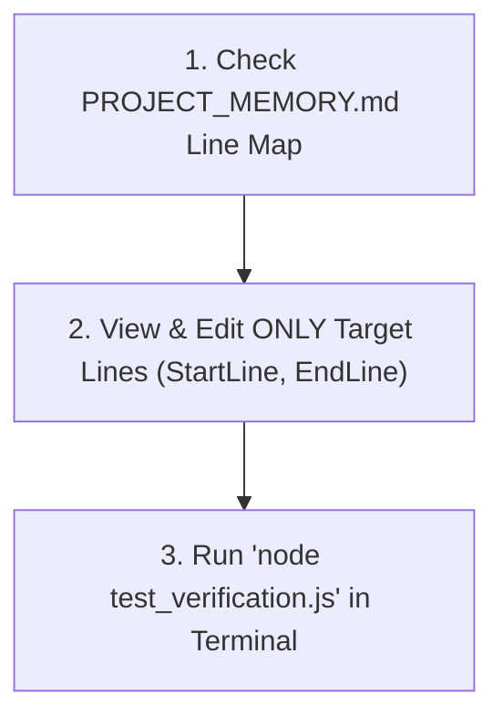

# The Supreme Laundry — Developer & Agent Workflow Guide

> **Goal:** Standard operating procedures for modifying the website with minimal token usage and zero layout regressions.

---

## 🚀 Quick Execution Protocol (Minimum Token Consumption)

When you need to make any update to this codebase, follow this 3-step workflow:



### ❌ Anti-Patterns (High Token Waste)
- **Do not** run `view_file` without `StartLine` and `EndLine`.
- **Do not** re-read the entire `index.html` (87KB) or `styles.css` (52KB).
- **Do not** rewrite whole files when only 5–10 lines need changing.

---

## 🛠️ Step-by-Step Task Workflows

### 1. How to Update Prices or Rate Card Items
1. Open `PROJECT_MEMORY.md` to get the line number for the service or pricing tab:
   - Services in HTML: Lines ~261 to 458
   - Calculator in HTML: Lines ~705 to 954
   - Garment calculator rates in JS: Lines ~380 to 420 in `js/app.js`
2. Use `replace_file_content` targeting only that 15–20 line chunk.
3. Run `node test_verification.js` to ensure the integrity tests pass.

### 2. How to Update Phone Numbers or Contact Details
1. Contact details exist in only 3 specific locations:
   - Header & Hero (HTML L50-70, L150-165)
   - Footer (HTML L1390-1440)
   - JS Constants: `js/app.js` L8-11:
     ```javascript
     const STORE_PHONE = '9831930837';
     const SECONDARY_PHONE = '9007895400';
     const WHATSAPP_PHONE = '919831930837';
     ```
2. Update the constants in `js/app.js` and the corresponding HTML lines.
3. Run `node test_verification.js`.

### 3. How to Update the Booking Modal or Form Fields
1. HTML fields are located between **L1525 and L1645** in `index.html`.
2. Form step transitions and validation are located between **L210 and L335** in `js/app.js`.
3. Modal styles are located between **L2228 and L2730** in `css/styles.css`.
4. Always test in mobile viewport (modal uses `calc(100dvh - 20px)` and safe-area insets).

### 4. How to Add a New Customer Review or FAQ Item
- **FAQ:** HTML L1199 to L1266. Copy an existing `.faq-item` block and update the question/answer. No JS update is required (uses event delegation).
- **Review:** HTML L956 to L1103. Copy an existing `.review-card` block.

---

## 🧪 Verification & Health Check

After any edit, execute the automated verification suite:

```bash
node test_verification.js
```

**Expected output:**
```text
🌟 ALL 59 INTEGRITY, BRANDING, RATE CARD & FULL RESPONSIVENESS CHECKS PASSED SUCCESSFULLY!
```

If any check fails, the console output will highlight the exact missing ID or style rule so you can fix it in a single targeted edit without scanning the whole repository.
